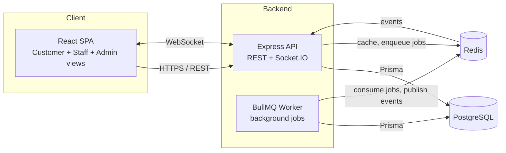

```mermaid
flowchart LR
    subgraph Client
        SPA[React SPA<br/>Customer + Staff + Admin views]
    end
    subgraph Backend
        API[Express API<br/>REST + Socket.IO]
        W[BullMQ Worker<br/>background jobs]
    end
    DB[(PostgreSQL)]
    R[(Redis)]

    SPA -- HTTPS / REST --> API
    SPA <-- WebSocket --> API
    API -- Prisma --> DB
    W -- Prisma --> DB
    API -- cache, enqueue jobs --> R
    W -- consume jobs, publish events --> R
    R -- events --> API
```
